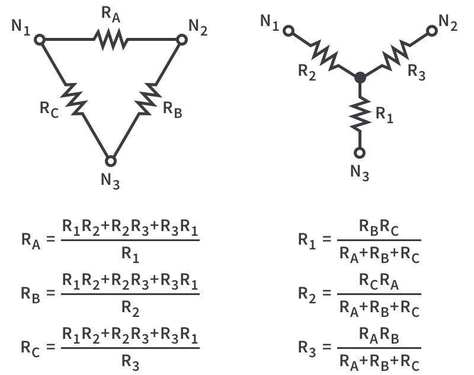

# Delta-Wye Conversion Calculator

Delta (Δ) and Wye configurations are two common ways to connect three impedances or loads in a three-phase circuit. The choice of configuration affects the way current and voltage behave in the system, and it often depends on the desired application or equipment being used. In a Delta network, the three impedances are connected in a closed loop, forming a triangle. Each corner connects to a line terminal, and the impedance appears between any two phases. In a Wye network, each impedance connects from a common central point (the "neutral") outward to the three line terminals, forming a Y shape.

This calculator uses Python running in the browser (via Pyodide) to perform Delta-Wye or Wye-Delta impedance conversions. Users start by selecting the **type of conversion** they want to perform using radio buttons: either from Delta to Wye or from Wye to Delta.
Next, the user enter the **three complex impedance values** (Z₁, Z₂, Z₃) into text fields. These values are expressed in Python complex number format (e.g., `3+4j`). Alternatively, if the user selects **"Balanced Load"**, only z1 needs to be entered and the calculator will assume all impedances are equal.

When the user clicks "Convert", the app reads the selected configuration and impedance values from the input fields. It passes them into a Python script that performs the appropriate conversion. The result is displayed as text output on the page.
